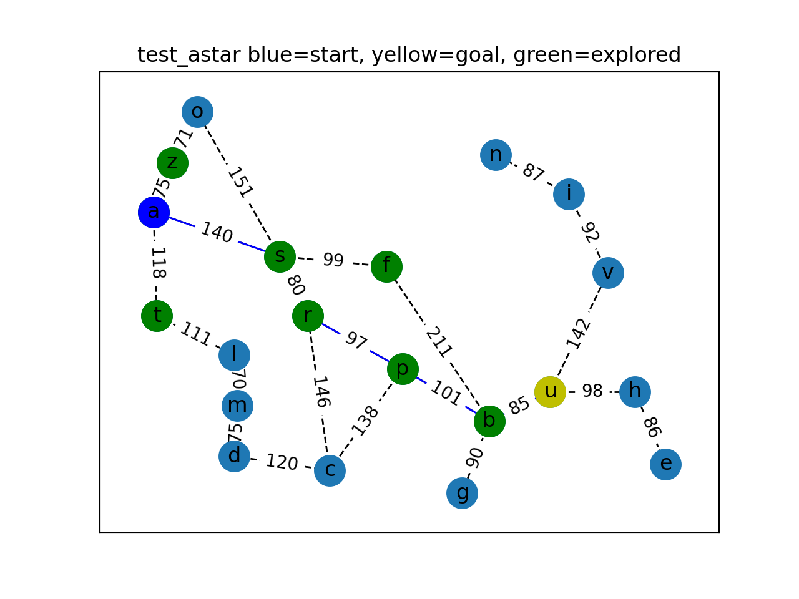
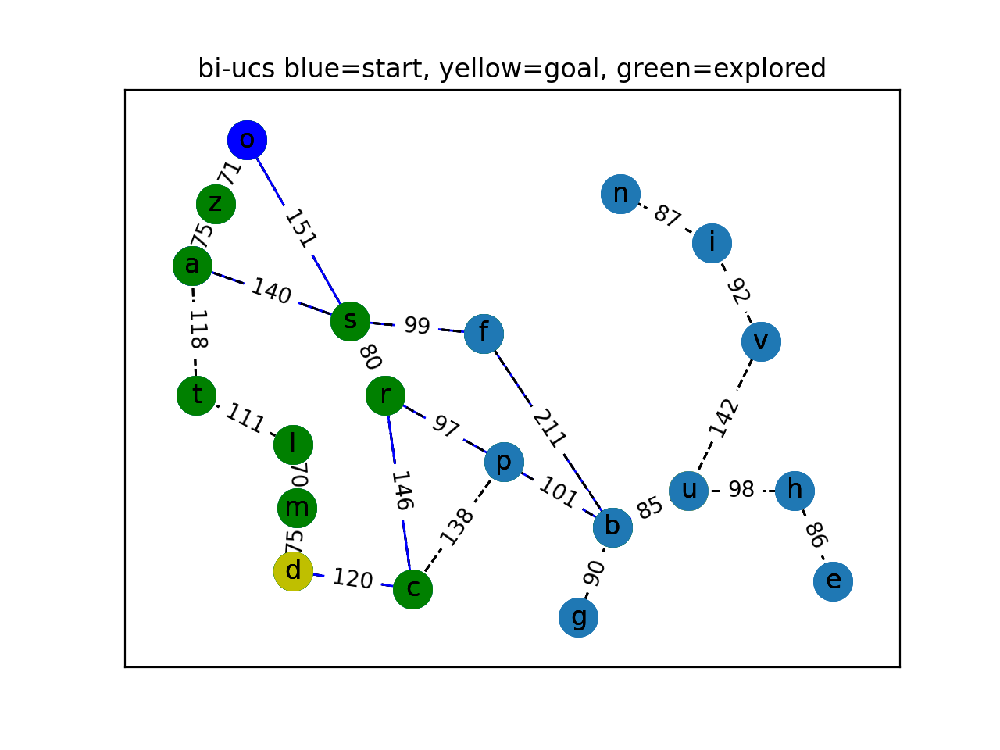

# CS 6601: Artificial Intelligence - Assignment 1 - Search

## Overview

Search is an integral part of AI. It helps in problem solving across a wide variety of domains where a solution isn’t immediately clear.  You will implement several graph search algorithms with the goal of solving bi-directional and tri-directional search.

## Objective

This project aims to impliment several informed search algorithms that will calculate a driving route between two points in Romania with a minimal time and space cost.

We will be using an undirected network representing a map of Romania (and an optional Atlanta graph used for the Race!).

#### Visualizing the Atlanta graph:

Since the Atlanta graph network is too big to display within a Python window like Romania, running the **_search_tests_grid.py_** generates a JSON file in the GeoJSON format. To see the graph, you can upload it to a private GitHub Gist or use [this](http://geojson.io/) site.
If you want to see how **_visualize_graph.py_** is used, take a look at the class TestBidirectionalSearch in **_search_tests.py_**

## Search Algorithms

### Basic Search Algorithms 

#### BFS

The `breadth_first_search()` method in **_search.py_** returns a path of nodes from a given start node to a given end node, as a list using the breadth first search algorithm.

#### Uniform-cost search

The `uniform_cost_search()` method in **_search.py_** should return the same arguments as breadth-first search: the path to the goal node (as a list of nodes) however it uses the uniform cost search algorithm. 

#### A-Star search
Implemented A-Star search using Euclidean distance as the heuristic. 

---
### Bidirectional Algorithms
Several bidirectional algorithms have also been implimented. The benefits of these algorithms over uninformed or unidirectional search are more clearly seen on larger graphs.

#### Bidirectional uniform-cost search

 Bidirectional uniform-cost search starting the search at both the start and end states. 
 

#### Bidirectional A-Star search

Bidirectional A-Star search that calculates a heuristic for both the start-to-goal search and the goal-to-start search.

#### Tridirectional UCS search

**In progress** Tridirectional search in the naive way: starting from each goal node, perform a uniform-cost search and keep
expanding until two of the three searches meet. This should be one continuous path that connects all three nodes.

For example, suppose we have goal nodes [a,b,c]. Then what we want you to do is to start at node a and expand like in a normal search. However, notice that you will be searching for both nodes b and c during this search and a similar search will start from nodes b and c.
